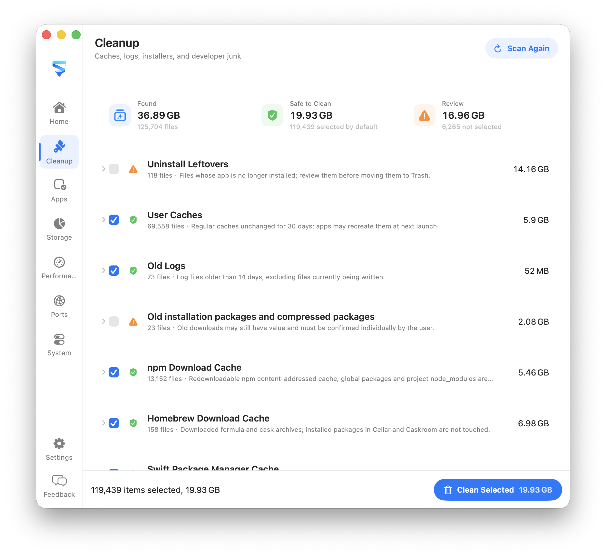
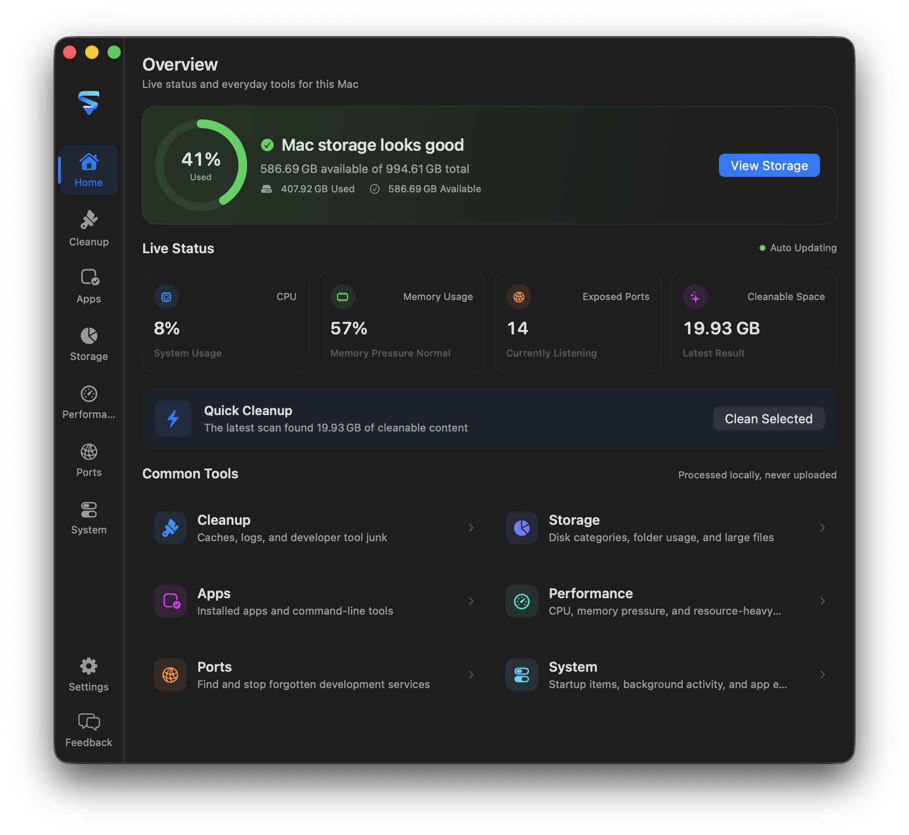

# Sift

[English](README.md) · [简体中文](README.zh-CN.md)

A privacy-first macOS utility for storage analysis, cleanup, app uninstall, port management, and login items & extensions.

Everything runs locally on your Mac. Scans read file metadata only, risky items stay unchecked by default, and deletions go to the Trash.

<p align="center">
  
</p>

<p align="center">
  
</p>

## Features

- **Cleanup** — Find caches, logs, leftover app data, and regenerable developer files, with clear safe / needs-review labels
- **Uninstall** — Remove apps together with related support files
- **Storage** — See disk usage by category and drill into large folders
- **Performance** — Monitor CPU, memory pressure, and top processes
- **Ports** — Inspect listening ports and stop processes you own
- **Login Items & Extensions** — Review login items, background tasks, and system extensions in one place

## Requirements

- macOS 14 or later
- Xcode 16 / Swift 6 (for building from source)
- Full Disk Access may be required for some user directories

## Install

Download the latest release from [GitHub Releases](https://github.com/rhevorn/sift/releases/latest).

## Build

Open the Xcode project and run the `Sift App` scheme:

```bash
open Sift.xcodeproj
```

Or build from the terminal:

```bash
xcodebuild \
  -project Sift.xcodeproj \
  -scheme "Sift App" \
  -configuration Debug \
  -derivedDataPath build/XcodeDerivedData \
  build

open build/XcodeDerivedData/Build/Products/Debug/Sift.app
```

Core library tests:

```bash
swift test
```

## Localization

English is the source language. The app also includes Simplified Chinese, Traditional Chinese, Japanese, Korean, Spanish, French, German, Brazilian Portuguese, and Russian.

## Project layout

```text
App/                 SwiftUI app, preferences, and app state
Sources/SiftCore/    Scanning, risk rules, cleanup, and system inventory
Resources/           App icon and Localizable.xcstrings
Tests/SiftCoreTests/ Core behavior and safety tests
Sift.xcodeproj/      macOS app project
Website/             Marketing site
```

## Contributing

Issues and pull requests are welcome. Keep changes focused, and prefer local, reversible operations for anything that deletes or terminates processes.
