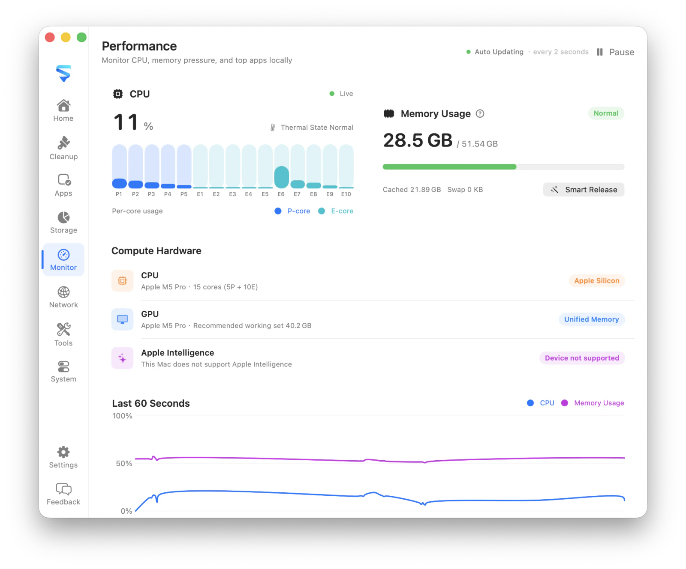

# MachKit

[English](README.md) · [简体中文](README.zh-CN.md)

A privacy-first macOS utility for storage analysis, cleanup, app uninstall, system monitoring, network inspection, annotated screenshots, and 19 focused local utilities.

MachKit has no analytics service or cloud backend. Scans read local file metadata only, risky items stay unchecked by default, and removable items go to the Trash unless the UI explicitly identifies an operation as permanent. Network diagnostics and cURL Lab send requests only when you explicitly start them, directly from your Mac.

<p align="center">
  <table cellpadding="12" cellspacing="0">
    <tr>
      <td align="center" bgcolor="#e8e8ed">
        
      </td>
    </tr>
  </table>
</p>

## Features

- **Cleanup** — Find caches, logs, leftovers, and developer files; risky items stay unchecked
- **Apps** — Browse apps and command-line tools, then uninstall with related support files
- **Storage** — Understand disk usage and large folders
- **Performance** — Follow CPU, memory pressure, thermal state, and busy apps ([performance details](Docs/monitoring.md))
- **Network** — Inspect traffic, connections, listening ports, routes, VPN/TUN, and proxies
- **System** — Review login items, background activity, and extensions
- **Menu bar** — Keep MachKit in the menu bar for quick access to features and Quit
- **Screenshot** — Capture any screen region from a global shortcut, freeze the desktop, annotate with rectangles, ellipses, arrows, pen, highlight, mosaic, and text, then copy or save—all on your Mac, without opening another window
- **Utilities** — Open 19 focused local tools from the Tools workspace, menu, or global shortcuts:
  - **Hosts Manager** — View `/etc/hosts` and switch shared / environment mappings safely
  - **Timestamp Converter** — Convert dates and Unix timestamps across units and time zones
  - **JSON Formatter** — Format, minify, sort keys, and query values with path expressions
  - **Codec** — Encode and decode Base64, Base32, Base62, Hex, URL, HTML, Unicode, Escape, and Hash
  - **String Generator** — Generate UUID v1–v7, ULIDs, Nano IDs, hex strings, and random strings locally
  - **Regex Lab** — Highlight matches, inspect capture groups, and try common replacements
  - **Text Diff** — Compare two texts side by side with line-level highlighting
  - **IP / CIDR** — Inspect IPv4 and IPv6 addresses or calculate IPv4 CIDR ranges locally
  - **Cron Expression** — Build five-field cron schedules and preview upcoming runs
  - **Color Lab** — Convert HEX, RGB, HSL, and HSV with local contrast checks
  - **QR Code** — Generate QR codes from text or URLs locally
  - **URL Lab** — Parse and rebuild URLs with query and hash editing
  - **Unit Converter** — Convert bases, bytes, time, length, mass, temperature, and other units locally
  - **Image Tools** — Convert formats and control output by quality, target size, or dimensions
  - **JWT Lab** — Decode, inspect, and create JSON Web Tokens locally
  - **chmod Lab** — Convert Unix permission modes and preview symbolic changes
  - **Certificate Lab** — Inspect PEM certificates, validity, fingerprints, and SANs locally
  - **cURL Lab** — Build, parse, edit, and explicitly run cURL requests directly from your Mac
  - **Port Scanner** — Scan any TCP port or range with progress and open-port results

## Requirements

- macOS 14 or later
- Xcode 16 / Swift 6 (for building from source)
- Node.js 24 / npm (for building the embedded H5 tools)
- Full Disk Access may be required for some user directories
- Editing hosts files requires administrator authentication when applying changes to `/etc/hosts`

## Install

When the maintainers configure Apple release credentials, MachKit releases are signed with Developer ID and notarized by Apple. Otherwise, the release workflow publishes an ad-hoc signed, non-notarized build and labels it clearly in the release notes.

1. Download `MachKit-*-macOS.zip` from [GitHub Releases](https://github.com/rhevorn/machkit/releases/latest).
2. Unzip it, then move `MachKit.app` into `/Applications`.
3. Open MachKit from Applications or Spotlight. For an ad-hoc signed release, Control-click the app and choose **Open** on first launch if macOS blocks a normal launch.

## Build

Install the locked embedded-tool dependencies once, then open the Xcode project and run the `MachKit App` scheme. Select your own development team in Xcode if signing is required:

```bash
cd Tool && npm ci && cd ..
open MachKit.xcodeproj
```

Or build from the terminal:

```bash
xcodebuild \
  -project MachKit.xcodeproj \
  -scheme "MachKit App" \
  -configuration Debug \
  -destination "generic/platform=macOS" \
  -derivedDataPath build/XcodeDerivedData \
  CODE_SIGNING_ALLOWED=NO \
  build

open build/XcodeDerivedData/Build/Products/Debug/MachKit.app
```

Core library tests:

```bash
swift test
```

Run the H5 development server when working on embedded tools:

```bash
cd Tool
npm ci
npm run dev
```

Debug builds can load tools from the local Vite server with HMR; Release builds always use the bundled `Resources/WebTools` output. See [Tool/README.md](Tool/README.md) for adding a tool.

## Releases

Local builds use `dev`. Release tags are the source of truth for shipped versions: pushing a tag such as `v0.9.0` overrides the app version with `CFBundleShortVersionString=0.9.0`; `CFBundleVersion` is the GitHub Actions run number plus 1000. The workflow verifies both values, then selects one of two explicit release modes: all documented Apple secrets produce a Developer ID signed, notarized, and stapled ZIP; no Apple secrets produce an ad-hoc signed, non-notarized ZIP. A partially configured secret set fails instead of silently downgrading. Existing tags can also be built from the workflow’s manual dispatch input.

```bash
git tag v0.9.0
git push origin v0.9.0
```

## Localization

English is the source language. The app also includes Simplified Chinese, Traditional Chinese, Japanese, Korean, Spanish, French, German, Brazilian Portuguese, and Russian. Embedded web tools follow the same locale and appearance preferences as the native UI.

## Project layout

```text
App/                   SwiftUI app, preferences, tool host, native bridges, and screenshots
Sources/MachKitCore/    Scanning, safety policy, cleanup, hosts, inventory, and geometry
Tests/MachKitCoreTests/ Core behavior, safety, and regression tests
Tool/                  React/TypeScript utilities bundled into Resources/WebTools
Website/               React/TypeScript marketing site and prerender pipeline
Resources/             App assets, localization catalog, and generated web-tool bundle
Docs/                  Focused technical documentation
Scripts/               Build, verification, localization, packaging, and release scripts
MachKit.xcodeproj/      macOS app project
```

## Contributing

Issues and focused pull requests are welcome. Install both locked frontend dependency sets, then run the repository verification script before opening a pull request:

```bash
(cd Tool && npm ci)
(cd Website && npm ci)
./Scripts/verify.sh
```

For embedded-tool UI changes, install Chromium once with `cd Tool && npx playwright install chromium`, then include UI smoke tests with `MACHKIT_RUN_UI_TESTS=1 ./Scripts/verify.sh`. Keep changes local-first, preserve Trash-first deletion behavior, add regression coverage for safety fixes, and update every supported locale when user-visible copy changes.

Report vulnerabilities privately as described in [SECURITY.md](SECURITY.md).

## License

[MIT](LICENSE)
