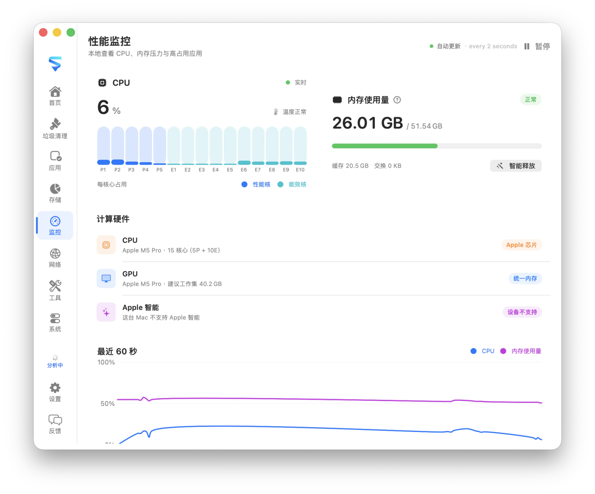

# MachKit

[English](README.md) · [简体中文](README.zh-CN.md)

一款隐私优先的 macOS 本地管理工具，用于存储分析、垃圾清理、软件卸载、系统监控、网络检查、区域截图标注，以及 19 个专注的本地实用工具。

MachKit 不使用分析服务或云端后台。扫描只读取本机文件元数据，风险项默认不勾选；可恢复内容会移入废纸篓，只有界面明确标注为永久删除的操作才会直接删除。网络诊断与 cURL 实验室仅在用户主动执行时从当前 Mac 直接发起请求。

<p align="center">
  <table cellpadding="12" cellspacing="0">
    <tr>
      <td align="center" bgcolor="#e8e8ed">
        
      </td>
    </tr>
  </table>
</p>

## 功能

- **垃圾清理** — 查找缓存、日志、应用残留和开发文件，风险项默认不勾选
- **应用** — 查看 App 和命令行工具，并连同支持文件一起卸载
- **存储分析** — 看清磁盘占用和大目录
- **性能** — 查看 CPU、内存压力、温度状态和高占用 App（详见 [性能说明](Docs/monitoring.md)）
- **网络** — 查看流量、连接、监听端口、路由、VPN/TUN 和代理
- **系统** — 查看登录项、后台活动和扩展
- **菜单栏** — 常驻菜单栏，快速打开功能与退出
- **截图** — 全局快捷键框选任意区域，冻结桌面后用矩形、椭圆、箭头、画笔、高亮、马赛克和文字标注，再复制或保存；全程留在本机，不必另开窗口
- **实用工具** — 可从 Tools 工作区、菜单或全局快捷键打开 19 个专注的本地工具：
  - **Hosts 管理** — 查看 `/etc/hosts`，在公共配置与多环境映射间安全切换
  - **时间戳转换** — 在日期与 Unix 时间戳之间转换，支持单位和时区
  - **JSON 格式化** — 格式化、压缩、键排序，并用路径表达式查询
  - **编解码** — Base64、Base32、Base62、Hex、URL、HTML、Unicode、转义与 Hash
  - **字符串生成** — 在本地生成 UUID v1–v7、ULID、Nano ID、十六进制字符串和随机字符串
  - **正则实验室** — 匹配高亮、分组捕获与常用替换
  - **文本 Diff** — 左右对比文本并高亮行级差异
  - **IP / CIDR** — 本地查看 IPv4 / IPv6 地址或计算 IPv4 CIDR 范围
  - **Cron 表达式** — 编写五段 cron 并预览接下来的执行时间
  - **颜色实验室** — 本地转换 HEX / RGB / HSL / HSV 并检查对比度
  - **二维码** — 本地从文本或 URL 生成二维码
  - **URL 实验室** — 解析与拼装 URL，编辑查询参数与哈希
  - **单位换算** — 本地换算进制、字节、时间、长度、质量、温度等单位
  - **图片处理** — 转换格式，并按质量、目标大小或尺寸控制输出
  - **JWT 实验室** — 在本地解码、检查和创建 JSON Web Token
  - **chmod 实验室** — 转换 Unix 权限模式并预览符号权限变化
  - **证书实验室** — 在本地检查 PEM 证书、有效期、指纹与 SAN
  - **cURL 实验室** — 构建、解析、编辑，并由用户主动从当前 Mac 直接发送 cURL 请求
  - **端口扫描** — 扫描任意 TCP 端口或范围，显示进度和开放端口

## 系统要求

- macOS 14 或更高版本
- 从源码构建需要 Xcode 16 / Swift 6
- 构建内嵌 H5 工具需要 Node.js 24 / npm
- 部分用户目录可能需要「完全磁盘访问权限」
- 将 hosts 应用到 `/etc/hosts` 时需要管理员认证

## 安装

维护者配置 Apple 发布凭据后，MachKit 发布包会使用 Developer ID 签名并经过 Apple 公证；没有配置凭据时，发布工作流会生成 ad-hoc 签名、未经公证的构建，并在 Release Notes 中明确标注。

1. 从 [GitHub Releases](https://github.com/rhevorn/machkit/releases/latest) 下载 `MachKit-*-macOS.zip`。
2. 解压后，将 `MachKit.app` 移到「应用程序」文件夹（`/Applications`）。
3. 从「应用程序」或 Spotlight 打开 MachKit。如果下载的是 ad-hoc 签名版本且 macOS 阻止直接启动，请在首次运行时按住 Control 点击 App 并选择「打开」。

## 构建

首次构建先安装锁定的内嵌工具依赖，再打开 Xcode 工程并运行 `MachKit App` Scheme；如需签名，请在 Xcode 中选择自己的开发团队：

```bash
cd Tool && npm ci && cd ..
open MachKit.xcodeproj
```

或在终端构建：

```bash
xcodebuild \
  -project MachKit.xcodeproj \
  -scheme "MachKit App" \
  -configuration Debug \
  -destination "generic/platform=macOS" \
  -derivedDataPath build/XcodeDerivedData \
  CODE_SIGNING_ALLOWED=NO \
  build

open build/XcodeDerivedData/Build/Products/Debug/MachKit.app
```

核心库测试：

```bash
swift test
```

开发内嵌 H5 工具时启动本地服务：

```bash
cd Tool
npm ci
npm run dev
```

Debug 构建可从本地 Vite 服务热更新加载工具；Release 构建始终使用打包进 `Resources/WebTools` 的产物。新增工具见 [Tool/README.md](Tool/README.md)。

## 发布

本地构建统一使用 `dev`。正式发布以 Git tag 作为版本唯一来源：推送 `v0.9.0` 后，工作流会将 App 版本覆盖为 `CFBundleShortVersionString=0.9.0`；`CFBundleVersion` 为 GitHub Actions 运行编号加 1000。工作流会校验版本，再明确选择两种模式之一：签名与公证 secrets 全部配置时，生成 Developer ID 签名、经过公证并装订票据的 ZIP；完全没有配置时，生成 ad-hoc 签名、未经公证的 ZIP。如果只配置一部分 secrets，工作流会失败而不是静默降级。已有 tag 也可以通过工作流的手动输入构建。

```bash
git tag v0.9.0
git push origin v0.9.0
```

## 本地化

英文为源语言。界面另支持简体中文、繁体中文、日语、韩语、西班牙语、法语、德语、巴西葡萄牙语和俄语。内嵌 Web 工具与原生界面共用语言和外观偏好。

## 项目结构

```text
App/                   SwiftUI 界面、偏好设置、工具宿主、原生桥接与截图
Sources/MachKitCore/    扫描、安全策略、清理、hosts、系统盘点与几何逻辑
Tests/MachKitCoreTests/ 核心行为、安全边界与回归测试
Tool/                  React/TypeScript 实用工具，打包进 Resources/WebTools
Website/               React/TypeScript 产品官网与预渲染流程
Resources/             App 资源、本地化目录与生成的 Web 工具包
Docs/                  精简的技术文档
Scripts/               构建、验证、本地化、打包与发布脚本
MachKit.xcodeproj/      macOS App 工程
```

## 参与贡献

欢迎提交 Issue 和目标明确的 Pull Request。安装两套锁定的前端依赖后，请在提交前运行仓库验证脚本：

```bash
(cd Tool && npm ci)
(cd Website && npm ci)
./Scripts/verify.sh
```

修改内嵌工具 UI 时，首次运行需通过 `cd Tool && npx playwright install chromium` 安装 Chromium，再用 `MACHKIT_RUN_UI_TESTS=1 ./Scripts/verify.sh` 纳入 UI 冒烟测试。所有改动应保持本地优先和优先移入废纸篓的删除策略；安全修复应补充回归测试，用户可见文案应同步所有受支持语言。

安全漏洞请按 [SECURITY.md](SECURITY.md) 私密报告。

## 许可证

[MIT](LICENSE)
